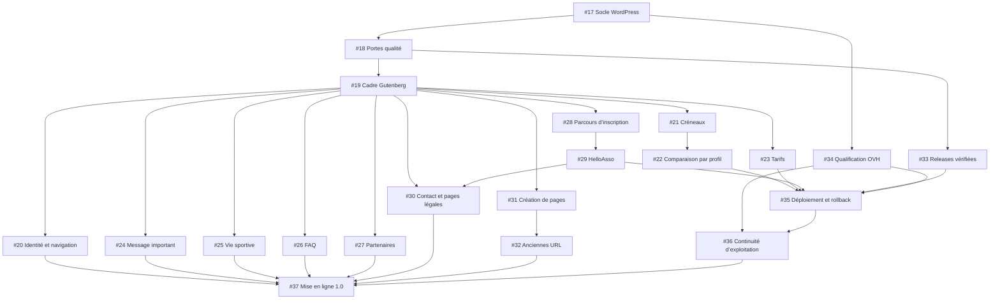

# Refonte du site : graphe d’exécution

Ce document s’applique à la spec [#16](https://github.com/antoineLZCH/esctt/issues/16) et à ses tickets [#17](https://github.com/antoineLZCH/esctt/issues/17) à [#37](https://github.com/antoineLZCH/esctt/issues/37).

## Règle d’exécution

Travaillez uniquement sur la **frontière** : un ticket ouvert, non assigné, dont tous les tickets indiqués dans `Blocked by` sont fermés.

1. Lire le corps complet et les commentaires du ticket ciblé.
2. Vérifier l’état et l’assignation de chacun de ses bloqueurs avec `gh issue view`.
3. Si tous les bloqueurs sont fermés, réclamer le ticket avec `gh issue edit <numéro> --add-assignee @me`.
4. Relire immédiatement le ticket : commencer seulement si l’assignation est confirmée et unique.
5. Après fermeture, recalculer la frontière ; les tickets devenus disponibles peuvent partir en parallèle.

Un agent traite un seul ticket à la fois. Les branches parallèles gardent la portée de leur ticket et se rebasent avant fusion. Les champs `Blocked by` des issues sont la source de vérité ; les vagues ci-dessous décrivent seulement les niveaux du graphe.

## Graphe des dépendances

Les arêtes transitives vers #37 sont omises pour préserver la lisibilité.

## Vagues maximales

| Vague | Tickets exécutables en parallèle une fois la vague précédente terminée |
| --- | --- |
| 1 | #17 |
| 2 | #18, #34 |
| 3 | #19, #33 |
| 4 | #20, #21, #23, #24, #25, #26, #27, #28, #31 |
| 5 | #22, #29, #32 |
| 6 | #30, #35 |
| 7 | #36 |
| 8 | #37 (`ready-for-human`) |

Le chemin critique probable est `#17 → #18 → #19 → #21/#28 → #22/#29 → #35 → #36 → #37`.
